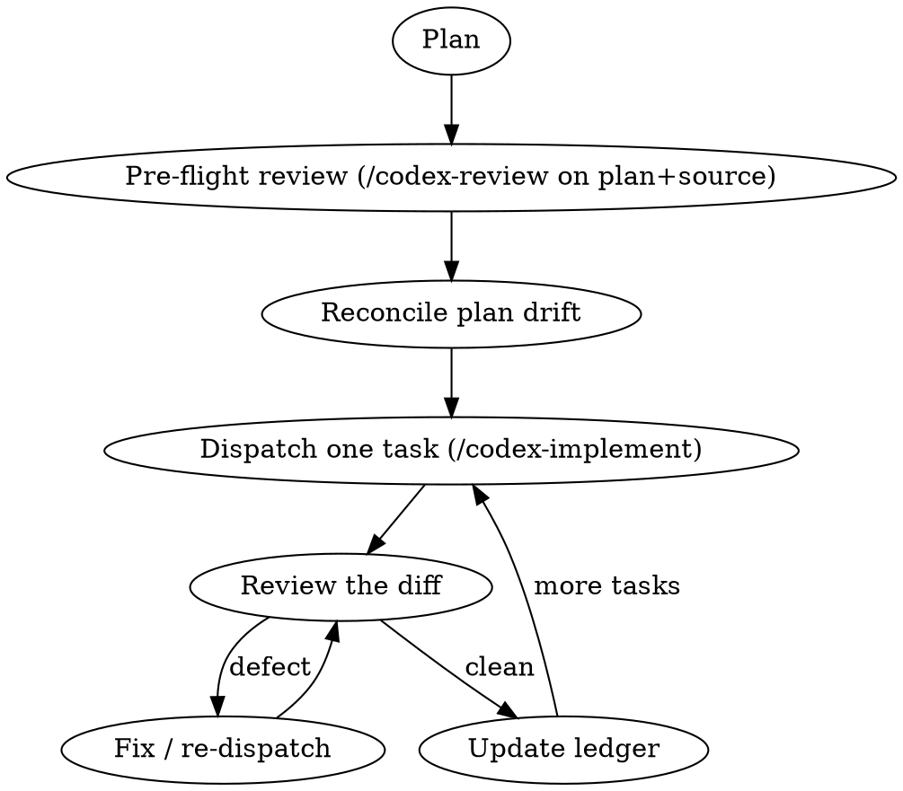

# Codex Subagent-Driven Development

This mirrors superpowers subagent-driven-development, but the **implementer is the OpenAI Codex CLI** (`codex exec`, gpt-5.5) and **Claude is the controller**. Codex reads the repo, edits files, runs tests, and commits — one plan task at a time. Claude dispatches, reviews each diff, fixes or re-dispatches, and keeps the ledger. The payoff is an independent second model: Codex catches integration defects a same-model pass rationalizes past.

## The one unlock you must know

**Run Codex with `-s danger-full-access`, NOT `--dangerously-bypass-approvals-and-sandbox`.**

- Codex's own bwrap sandbox fails inside containers (`bwrap: Failed to make / slave: Permission denied`); in that state Codex can't read or write repo files, so reviews come back empty and implementations no-op.
- `-s danger-full-access` disables only the broken sandbox *mode*, gives real FS read/write/exec, **and passes Claude Code's auto-mode permission classifier**. The `--dangerously-bypass-*` flag is blocked by the classifier (Safety-Bypass-Flag rule), and the classifier also blocks Claude from self-editing `settings.json` to allowlist it.

The `${CLAUDE_PLUGIN_ROOT}/scripts/codex-run.sh` wrapper defaults to this and encodes the rest of the gotchas (dual timeouts, output capture, bwrap detection, partial-run recovery). Prefer the commands (`/codex-implement`, `/codex-review`, `/codex-critique`) — they call the wrapper for you.

## The controller loop

1. **Write the plan first.** Use superpowers `writing-plans`. Each task names the exact files, the exact code, and the tests that gate it. Codex reads the plan file itself — you never paste it.
2. **Pre-flight review the plan against real source** with `/codex-review <plan.md>`. Pointing gpt-5.5 at the plan + the actual tree reliably surfaces line-anchor drift, dispatch-signature mismatches (arity/return type), a second validator recomputing a total with the wrong formula, renderers hardcoding old field names. **Reconcile every defect into the plan before implementing** — this is the highest-leverage step.
3. **Dispatch one task** with `/codex-implement <plan.md> <taskN>`. The implementer contract: implement only that task, use the plan's exact code, don't touch unrelated lines, run the named tests, commit exactly the named files with the plan's message + required trailer, report only the test PASS line(s) and `git show --stat HEAD`, and **STOP and report if any code anchor doesn't match** the real file (no guessing).
4. **Review the resulting diff yourself.** Only the named files changed? Matches the plan? Trailer present? Tests real? If not, fix it or re-dispatch — you own the final state.
5. **Update the ledger** (which task is done, its commit, test result) and move to the next task.

## Two Codex roles, two access modes

| Role | Needs FS? | How | Command |
|------|-----------|-----|---------|
| FS-aware implementer / reviewer | yes — walks & edits the tree | `-s danger-full-access`, point it at paths | `/codex-implement`, `/codex-review` |
| Pure-reasoning critic | no — context is pasted | same sandbox, self-contained prompt | `/codex-critique` |

## Operational gotchas (all handled by the wrapper, but know them)

- **Dual timeouts.** Codex runs take minutes. The wrapper's inner `--timeout` AND the Claude Code Bash-tool `timeout` parameter must BOTH be generous. If only the inner one is set, the Bash tool's 120s default SIGTERMs Codex (exit 143) mid-task, leaving **uncommitted partial edits**. Recovery: `git checkout -- .`, remove stray new files, retry with larger timeouts on both layers.
- **Huge, duplicated output.** A single review can stream ~87k tokens of file reads + reasoning. The wrapper captures to a log and prints only Codex's clean final message (via `-o`), falling back to the text after the last `tokens used` marker. Read the tail, not the stream.
- **bwrap detection.** If the sandbox fails, the wrapper surfaces the `-s danger-full-access` remedy instead of returning an empty review.
- **Commit hygiene.** Codex commits as the configured git user; the implementer contract makes it append the project's required trailer line.

## When NOT to use this

- Trivial one-line changes — just do them.
- Tasks with no written plan — write the plan first (a Codex implementer without a plan drifts).
- Environments where you want Codex to leave commits to a separate hook (e.g. a handoff-driven team workflow) — that's a different contract; see this plugin's README "Relationship to other plugins".
