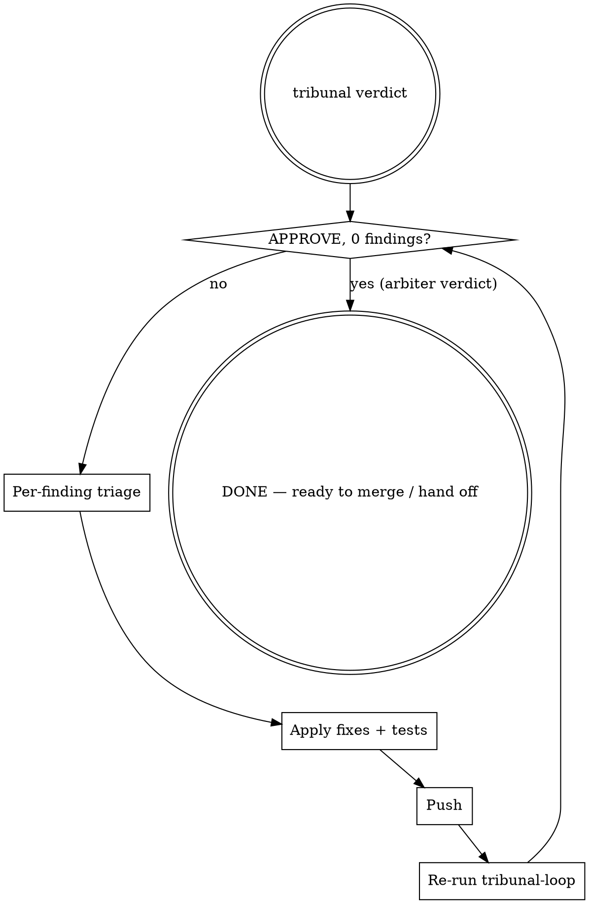

# Closing the Tribunal Loop

## Overview

`tribunal-loop` is one round of review. **Closing the loop is iterative**: after any code change, the diff has changed and findings can change with it — new bugs introduced by the fix, old findings invalidated, false positives clarified. The loop only closes when the Opus arbiter returns an `APPROVE` verdict with zero findings on the **latest** diff.

**Core principle:** Tribunal is a quality gate, not a checklist. The gate stays closed until the diff itself stops generating findings — including findings caused by your own fixes.

## When to Use

- Just ran `tribunal-loop` and the arbiter verdict is `NEEDS_WORK` or `BLOCK`
- Made a code change in response to a tribunal finding (any change → re-run required)
- About to mark the PR ready / merge / hand off, but haven't re-run tribunal since the last commit

**Don't use when:**
- Tribunal verdict is `APPROVE` with 0 findings on the current diff
- Reading findings only (no code change planned)
- The PR is documentation-only or you're not running tribunal at all

## The Loop



The loop only exits when the Opus arbiter issues **`APPROVE` with 0 findings** on the current diff. The arbiter runs four advisory reviewers (Codex, Gemini, GLM, DeepSeek) in parallel precisely because any single reviewer can miss things — so a verdict built on the latest diff is the only verdict that counts.

## Per-Finding Triage

You triage the **arbiter's findings** (`T-001`, `T-002`, …), each already deduplicated and tagged with a `consensus` type (`CONSENSUS`/`SINGLE`/`ARBITRATED`) and supporting `providers`. For every finding, decide one of three outcomes:

| Outcome | When |
|---|---|
| **Fix in this PR** | Real bug + introduced or affected by this PR's diff |
| **File follow-up issue** | Real bug + pre-existing or explicitly out of PR scope |
| **Reject** | False positive (verified against actual code) |

Verify each finding by reading the cited line and reasoning about it (or running a 30-second repro). Don't trust the consensus label or confidence number on its own — a `CONSENSUS` finding can be a shared false positive, and a `SINGLE` finding (one reviewer) can be a real bug. Verification is cheap; trusting blindly is expensive.

**One commit per finding (or per cluster of related findings)** with the finding ID in the commit message body — `tribunal T-001`, `tribunal T-004 / T-005`. This makes the loop trail readable in `git log`.

## Stop Condition

The loop is closed only when **the LATEST diff** (post-all-fixes) produces an arbiter verdict of:
- `tribunal_verdict.decision == APPROVE`
- `findings: []` (zero actionable findings)

A `NEEDS_WORK` or `BLOCK` from the arbiter — even one driven by a single dissenting reviewer — is not closed. Those findings need triage.

**Common rationalizations to ignore:**

| Excuse | Reality |
|---|---|
| "I fixed everything they asked, ship it" | Fixes change the diff. Re-run. |
| "Round 1 was thorough, no need to re-check" | Round 1 reviewed a different diff than what's now on the branch. |
| "It's only a SINGLE finding (one reviewer), low signal" | Single-reviewer findings have caught real bugs — verify before dismissing. |
| "The new finding is just nitpicking" | Verify it's actually a nitpick before judging it. The previous round's "nitpick" might be your real bug. |
| "I'll re-run if the reviewer asks" | The tribunal is the reviewer. It can't ask for what it hasn't seen. |

If any of these thoughts appear: re-run tribunal anyway. A few minutes to re-run beats a customer-facing regression.

## Follow-Up Issue Template

When triage decides "file follow-up" rather than "fix in this PR", file a real GitHub issue (or comment on a pre-existing one if cited). Use this body template — dense, actionable, lets the next person fix without re-deriving the context:

```markdown
## Context

Brief note on which PR surfaced this and why it's deferred (e.g., out of
original issue scope, requires separate design decision, blocked on X).

## Current behaviour

File:line citation + 2-3 lines of code or behaviour description.

## Failure scenario

Concrete repro: a specific input that triggers the bug, expected vs
actual output. Use a table when contrasting pre- vs post-state.

## Fix sketch

The smallest change that closes the bug. One paragraph or short code
block. Include any acceptance test that should pin the fix.

## Severity

Low / Medium / High / Critical, with one sentence on customer impact
and triggering preconditions ("only bites returning customers who…").

## Discovered by

Tribunal review of PR #N, finding T-XXX (consensus type, confidence).
```

The template exists because tribunal findings have **structured context** (severity, consensus type, supporting providers, confidence, file/line, description, suggestion) that's lost if you just paste a one-line "fix this later". Preserve the structure so the next session can act on the issue without re-running tribunal.

**Cross-link both directions** when you file: the PR commit message references the issue (`tracked at #N`) AND the issue references the PR (`Discovered by tribunal review of PR #N`).

## Common Mistakes

- **Stopping after round 1** because all original findings were addressed. The fixes are themselves a new diff — they can have their own bugs.
- **Bundling out-of-scope fixes into the PR** to "reduce churn". Bloats the diff, expands review surface, makes rollback messier. File a separate issue and a separate PR.
- **Filing follow-up issues with one-line bodies** ("fix the cart_total typing bug"). When the next session picks it up, they have to re-derive context. The template makes the next fix mechanical.
- **Declaring done on a stale verdict** — re-running tribunal after a fix but acting on the previous round's verdict, or skipping the re-run entirely. Only the arbiter verdict on the current HEAD counts.

## Related

- `tribunal-loop` — single round of multi-provider review (this skill is what to do *after* it returns)
- `superpowers:receiving-code-review` — verification-not-performative-agreement applies to tribunal findings too
