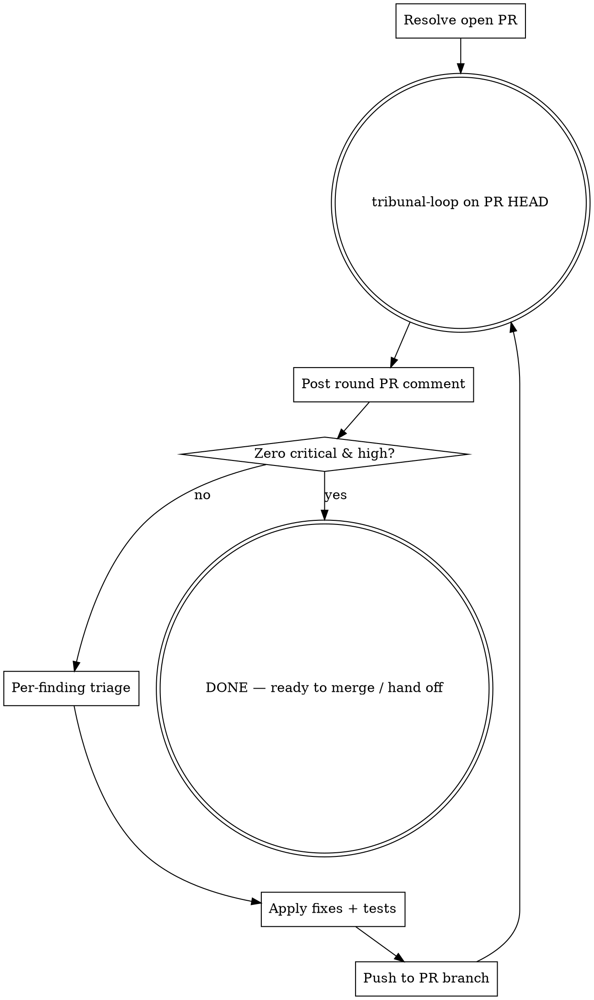

# Closing the Tribunal Loop

## Overview

`tribunal-loop` is one round of review. **Closing the loop is iterative and PR-only**:
after any code change, the diff has changed and findings can change with it. The loop
closes when the arbiter returns a verdict with **zero critical and zero high findings**
on the latest diff (medium/low go to YAGNI triage). Every code change re-opens the
diff, so re-run after any fix.

**Every round is documented on the open PR** — verdict, triage dispositions, commits,
follow-ups, and checkpoint/ceiling notes land as PR comments. Session chat is not the
audit trail.

**Core principle:** Tribunal is a quality gate, not a checklist. The gate stays closed
until the diff itself stops generating critical/high findings — including findings
caused by your own fixes.

## PR prerequisite (hard)

This skill **requires an open GitHub PR** for the current branch. No branch-only or
local-only close-out.

**Before every round** (not only once): push local commits, refresh PR metadata, and
require local HEAD == PR head:

```bash
git push
PR_JSON="$(gh pr view --json number,url,headRefOid,baseRefName,headRefName,state)"
PR_NUMBER="$(printf '%s' "$PR_JSON" | jq -r .number)"
PR_URL="$(printf '%s' "$PR_JSON" | jq -r .url)"
PR_HEAD="$(printf '%s' "$PR_JSON" | jq -r .headRefOid)"
LOCAL_HEAD="$(git rev-parse HEAD)"
```

Stop if `gh pr view` fails, `state` is not `OPEN`, there is no PR for this branch, or
`LOCAL_HEAD` ≠ `PR_HEAD`. Open (or re-open) a PR and push until they match, then resume.
The round comment's **HEAD** field must be this same full sha.

## Frozen Delivery Contract

Before triage, freeze the original task outcome, acceptance checks, preserved invariants,
and exclusions using only explicit user, issue, PR, or plan text. Never invent missing
acceptance criteria, invariants, or exclusions. Findings may prove that the current diff
violates that contract. They do not redefine the task. Expand the current PR only for a
verified defect caused or exposed by the diff whose fix is required by the frozen
acceptance checks or removes a material regression. Do not expand investigation for
adjacent concerns beyond evidence already present. File a follow-up only when that
evidence is sufficient; otherwise record or drop the concern **in the round PR comment**.

## When to Use

- Just ran `tribunal-loop` on a branch with an **open PR** and the verdict is
  `NEEDS_WORK` or `BLOCK`
- Made a code change in response to a tribunal finding (any change → re-run required)
- About to mark the PR ready / merge / hand off, but haven't re-run tribunal since the
  last commit

**Don't use when:**
- There is no open PR for the current branch (open one first)
- Tribunal verdict is `APPROVE` with zero critical/high on the current diff **and** the
  closing round comment is already posted
- Reading findings only (no code change planned) and you are not documenting a round
- Documentation-only change or you are not running tribunal at all

## The Loop


```dot
digraph close_tribunal {
    "Resolve open PR" [shape=box];
    "tribunal-loop on PR HEAD" [shape=doublecircle];
    "Post round PR comment" [shape=box];
    "Zero critical & high?" [shape=diamond];
    "Per-finding triage" [shape=box];
    "Apply fixes + tests" [shape=box];
    "Push to PR branch" [shape=box];
    "DONE — ready to merge / hand off" [shape=doublecircle];

    "Resolve open PR" -> "tribunal-loop on PR HEAD";
    "tribunal-loop on PR HEAD" -> "Post round PR comment";
    "Post round PR comment" -> "Zero critical & high?";
    "Zero critical & high?" -> "DONE — ready to merge / hand off" [label="yes"];
    "Zero critical & high?" -> "Per-finding triage" [label="no"];
    "Per-finding triage" -> "Apply fixes + tests";
    "Apply fixes + tests" -> "Push to PR branch";
    "Push to PR branch" -> "tribunal-loop on PR HEAD";
}
```

### Round number (resume-safe)

Never hardcode “round 1” on a PR that already has trail comments. Before each round:

```bash
# Max N already posted on this PR (0 if none)
PRIOR_MAX="$(gh api "repos/$(gh repo view --json nameWithOwner -q .nameWithOwner)/issues/${PR_NUMBER}/comments" \
  --paginate -q '.[].body' | grep -oE '<!-- tribunal-round:[0-9]+ -->' \
  | grep -oE '[0-9]+' | sort -n | tail -1)"
PRIOR_MAX="${PRIOR_MAX:-0}"
ROUND=$((PRIOR_MAX + 1))
```

- Reject posting a duplicate `(round, HEAD)` pair if a comment already carries both.
- Ceiling is **cumulative on the PR**, not per session: if `PRIOR_MAX >= 5` and
  critical/high still remain, you are already at/over the hard ceiling — stop and
  escalate (do not reset to round 1).
- Round 3 checkpoint / round 5 ceiling use this same cumulative `ROUND`.

### Round lifecycle (order is mandatory)

After each `tribunal-loop` (including the final close):

1. **Triage** findings (verify; decide fix-in-PR / follow-up / reject; file follow-ups
   and record rejects).
2. **Post and verify** the round PR comment for this `ROUND` + `LOCAL_HEAD` **before**
   applying code fixes for that verdict. A round without a verified comment is not
   complete. Load body from `references/round-comment.md` (`<!-- tribunal-round:N -->`,
   `gh pr comment --body-file`).
3. If critical/high remain: apply fixes + tests, **push**, re-check HEAD == PR head,
   run the next round (step 1 again).
4. If zero critical/high: stop (final comment already posted in step 2).

Disposition lines for still-uncommitted fixes are `will-fix` (no commit sha yet).
After the fix lands, the next round's HEAD and trail show the result. Do not reverse
the order to “fix then comment” — a failed fix/push must not leave the verdict
undocumented on the PR.

The loop only exits when the arbiter's verdict has **zero critical and zero high
findings** on the current diff. Default panel: Codex, Grok, Claude (Gemini, DeepSeek,
GLM, Qwen opt-in).

## Per-Finding Triage

Triage the **arbiter's findings** (`T-001`, …) — already deduplicated with
`consensus` (`CONSENSUS` or `SINGLE_PROVIDER`) and `providers`. For each finding, decide
one outcome and record it in the round PR comment:

| Outcome | When |
|---|---|
| **Fix in this PR** | Verified bug caused/exposed by this diff and required by the frozen acceptance checks or to remove a material regression |
| **File follow-up issue** | Verified, plausibly actionable bug that is pre-existing or explicitly out of PR scope |
| **Reject** | False positive (verified against actual code) |

Verify against the cited code (or a 30s repro). Don't trust consensus/confidence alone.
Use the smallest causal fix consistent with the existing architecture. Validate the
reproduced finding and the original acceptance checks; no broader audit or generalized
machinery for hypothetical variants.

**One commit per finding (or related cluster)** with the finding ID in the message body
— `tribunal T-001`. Trail is readable in `git log` and in the round comment.

Follow-up issue body: `references/follow-up-issue.md`. Cross-link PR ↔ issue both ways.

## Stop Condition

Closes on **zero `critical` and zero `high`** on the latest diff. Medium/low do not
hold the gate — YAGNI triage below.

A `high` is **cleared** when it is fixed, re-rated below high by the arbiter (failed
3b-0), or **descoped** (mechanism removed from the diff + follow-up issue filed).

Post a final round comment on close (even if round 1 is already zero-crit/high).

### YAGNI triage (leftover medium/low at close)

- File a follow-up **only if** reachable/real **and** worth acting on.
- Otherwise drop it in the **closing round PR comment** (never silent). Optional PR-body
  mirror: `Tribunal: N low findings dropped (YAGNI) — <reason>`.

### Retry, checkpoint, ceiling

- **Retry** while any critical/high remains (never YAGNI-drop them).
- **Round 3 — checkpoint:** PR comment + progress note to caller; do not stop.
- **Round 5 — hard ceiling:** STOP, post ceiling PR comment, escalate with standing finding.

## Step-back workflow (anti-spiral)

- **Rounds 1–2:** address findings directly.
- **Round 3+ while gate open:** **step-back mode** — stop adding guards; if findings
  share a *class* (design problem, not bug), choose exactly one:
  - **Simplify** within original acceptance criteria and existing architecture so the
    class disappears. Broader redesign → descope or escalate.
  - **Descope** — remove contested mechanism + file follow-up.
  - **Confirm-unreachable** — arbiter down-rates under 3b-0 / reachability.md.
- Stay in step-back on later stalled rounds; do not guard-pile. Record the choice in
  the round PR comment.

**Falsifiable output:** a step-back round must produce (a) collapsed class with
defensive-mechanism count not increased (added ≤ removed), or (b) descope + linked
follow-up, or (c) arbiter ruling the class fails 3b-0. "Added another guard, relabeled
as re-architecture" is invalid (no-net-increase check).

## Common Mistakes

- **No open PR** — chat-only close-out is not this skill.
- **Reviewing unpushed HEAD** — local `HEAD` ≠ PR `headRefOid`; push and re-check first.
- **Resetting round count on resume** — always derive `ROUND` from existing markers.
- **Skipping the round PR comment** — no `<!-- tribunal-round:N -->` means no audit trail.
- **Fix-before-comment** — post the verdict/dispositions before applying fixes.
- **Stopping after round 1** — fixes are a new diff; re-run.
- **Bundling out-of-scope fixes** — file a separate issue/PR.
- **One-line follow-up issues** — use `references/follow-up-issue.md`.
- **Stale verdict** — only the arbiter result on current HEAD counts, after its round
  comment is posted.

## Related

- `tribunal-loop` — single multi-provider review round
- `references/round-comment.md` — PR comment template + post/verify
- `references/follow-up-issue.md` — follow-up issue body
- `superpowers:receiving-code-review` — verify findings, don't performatively agree
